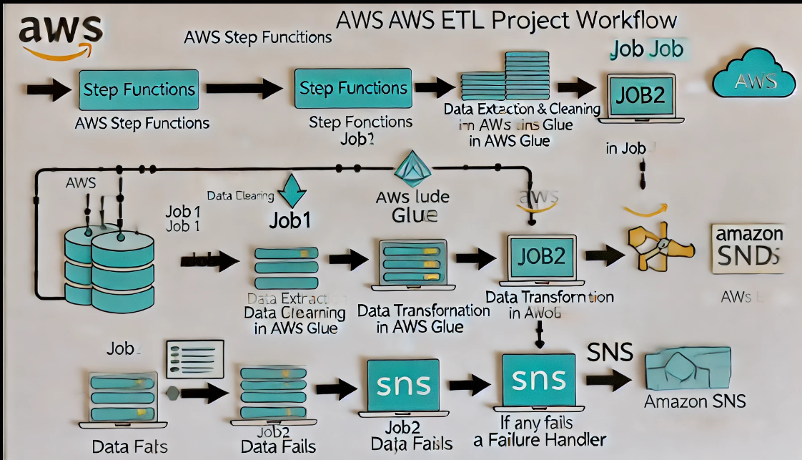
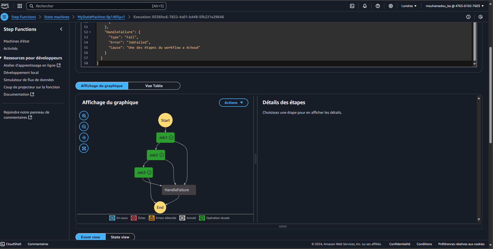

# 🚀 Projet ETL Automatisé avec AWS Glue et Step Functions

Un pipeline ETL utilisant AWS Step Functions pour orchestrer les tâches, AWS Glue pour les transformations de données et d'AWS Lambda pour notifier en temps réel l'achèvement du processus.

## 🎯 Objectif du Projet
Ce projet vise à établir un pipeline ETL automatisé et évolutif pour transformer les données de manière fiable et notifier en fin de processus les systèmes de suivi ou de monitoring, permettant ainsi de gérer les flux de données sans se soucier d’une infrastructure complexe.

## 🏗️ Architecture


### Services AWS Utilisés
- **AWS Glue** : Exécute les transformations de données en trois étapes.
- **AWS Step Functions** : Orchestration du workflow ETL, avec gestion intégrée des erreurs.
- **AWS Lambda** : Envoie une notification à la fin du processus via SNS.


## Détails des étapes du workflow

Chaque étape est orchestrée par AWS Step Functions et gère les tâches suivantes :

- **Job1** : Extraction des données
- **Job2** : Transformation et nettoyage des données
- **Job3** : Chargement des données




## 📂 Structure du Projet
- `data/` : Fichiers de données pour les jobs Glue.
- `src/` : Scripts Python pour chaque job Glue.
- `lambda_function/` : Code de la fonction Lambda.
- `step_function/` : Définition JSON du workflow Step Functions.
- `docs/` : Documentation détaillée du workflow et de l'architecture.
-  `Images/` : Diagrammes de l'architecture et des étapes du workflow Step Functions.

## Prérequis
- Compte AWS avec les permissions nécessaires.
- Python 3 et `boto3` pour la fonction Lambda.


## ⚙️ Configuration et Déploiement

1. **Configurer les rôles IAM** pour AWS Glue, Lambda et Step Functions, en leur donnant les permissions nécessaires.
2. **Déployer les scripts** dans les services respectifs : les scripts Glue dans AWS Glue et le script Lambda dans AWS Lambda.
3. **Configurer SNS** pour recevoir les notifications via SMS ou email.
4. **Créer le workflow Step Functions** en important `etl_pipeline_workflow.json`.

## 🚀 Exécution

1. Démarrer le workflow Step Functions.
2. Suivre les étapes de transformation de données dans AWS Glue.
3. Recevoir une notification automatique lorsque le processus est terminé.

## 📑 Description des Étapes

Le fichier `docs/workflow_Description.md` détaille chaque étape du workflow, incluant les configurations spécifiques de chaque job Glue et les conditions de gestion d'erreurs.

## 🔧 Dépendances

Les dépendances pour la fonction Lambda sont dans le fichier `requirements.txt`. Installez-les en exécutant :
```bash
pip install -r src/lambda/requirements.txt
